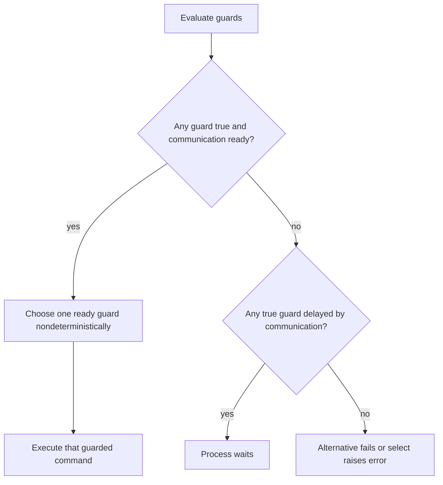
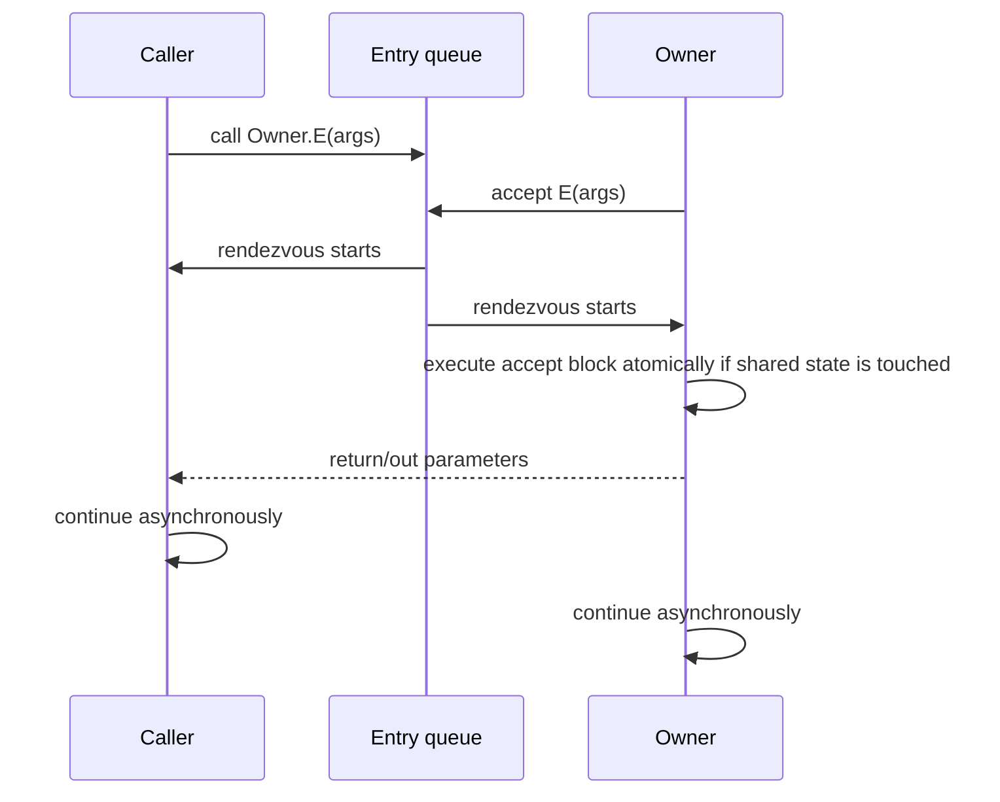

# Distributed Programming Models

## Purpose
Use this reference for CSP-style communication, guarded commands, MPI protocol design, RPC/RMI semantics, remote invocation, and rendezvous-based synchronization.

## Multiprocessing And SPMD
- Multiprocessing uses multiple hardware processors to execute program instructions.
- MIMD is the natural model for modern multi-threaded and multi-process systems, but it introduces contention and deadlock risks.
- MPI commonly uses SPMD: each process runs the same program, while rank and communicator determine which data and branch each process handles.

## Message-Passing Safety Modes
| Mode | Sender Behavior | Receiver Behavior | Main Risk |
| --- | --- | --- | --- |
| Synchronous unbuffered | Blocks until receiver participates | Blocks until sender participates | Idle wait or deadlock from unmatched order |
| Buffered blocking | Returns after safe copy into queue/buffer | Blocks if no message exists | Buffer management and queue saturation |
| Non-blocking unbuffered | Returns after request is prepared | Completion must be checked | Unsafe buffer mutation before completion |
| Non-blocking buffered | Transfer proceeds from internal buffer | Receiver must not use data too early | Completion and visibility confusion |

## Guarded Commands
A guarded command executes only when its Boolean guard is true and its communication can proceed.

Rules:
- Guards prevent server processes from blocking on a passive client.
- Guards must be side-effect free.
- Readiness is determined for one execution of the select/alternative order.
- To recompute readiness, repeat the select/alternative command.

## CSP Commands
CSP-style modeling disallows shared global variables between processes. Interaction occurs through matching input/output commands.

Command behaviors:
- `SKIP` has no effect and never fails.
- Assignment evaluates the right-hand side before assigning; failure prevents partial assignment.
- Input/output match only when process names, constructors/channel shape, and data types match.
- Matching input and output execute simultaneously as a communication event.
- Parallel order starts component processes together and completes only when all complete.

Deadlock examples:
- Two outputs waiting on each other do not match.
- Input and output with incompatible types do not match.
- Alternative order with all failed guards fails.

## Alternative And Repetitive Orders
Alternative order:
- Executes exactly one guarded command selected from the successfully evaluated guards.
- If multiple guards are available, selection is nondeterministic.
- Nondeterminism is not randomness. Correctness must not depend on a particular choice.
- Fairness is not guaranteed; a continuously available guard can be skipped indefinitely unless the language/runtime adds priority or fairness.

Repetitive order:
- Repeats its alternative order until all guards fail or referenced source processes terminate.
- Can delay if guards are true but required communication is not ready.
- Can deadlock if no I/O order matches, source processes have not terminated, and guards do not fail.

Deadlock test for repetitive constructs:
- No matching I/O pair exists.
- Not all source processes have terminated.
- Not all guards fail.

## CSP Server Patterns
- Binary semaphore server: accept `P()` then `V()` from clients in a controlled sequence.
- General semaphore server: accept `V()` to increase count; accept `P()` only when count is positive.
- Producer-consumer buffer server: accept producer data only when size `< N`; accept consumer request only when size `> 0`.
- Museum counter/server: use guarded selection so either input source can be accepted without blocking on the other.

## MPI Protocol Design
MPI message wrapper:
- Source rank.
- Destination rank.
- Communicator.
- Tag.
- Payload buffer.

Design rules:
- Use communicators to isolate protocol contexts.
- Use tags as protocol states or message classes.
- Blocking `MPI_Send`/`MPI_Recv` pairs are easier to reason about but can deadlock if both peers send first.
- Non-blocking `MPI_Isend`/`MPI_Irecv` require `MPI_Test`, `MPI_Wait`, or related completion checks.
- Status objects should be used when the source, tag, or count matters after receive.
- Polling operations are useful only when the process has independent work while waiting.

## Remote Procedure Or Method Calls
Remote procedure calls provide a procedure-like syntax but distributed semantics:
- Arguments are sent to the server, often through generated stubs.
- The client suspends while the remote procedure executes.
- Server-side arguments are reconstructed and results returned.
- A symbolic name or registry can bind a service to an endpoint.
- Multiple calls can create concurrent server-side threads, so server-side shared data still needs mutual exclusion.

RMI-specific semantics:
- Primitive parameters are passed by copy.
- Objects implementing a remote interface can be passed by reference.
- Serializable non-remote objects are passed by copy.
- The same method-call syntax can have different effects depending on whether the object is local or remote, so do not infer distributed behavior from syntax alone.

## Remote Invocation And Rendezvous
Remote invocation differs from RPC/RMI because the called operation belongs to another process and executes only when the owner process accepts it.

Entry-point model:
- The owning process declares entry points.
- Callers queue pending calls at the entry point.
- The owner process executes `accept` to rendezvous with one caller.
- Each entry queue is FIFO in the described model.
- Before and after the rendezvous, caller and callee run asynchronously.

Non-deterministic select with rendezvous:
- Each `when` alternative has a guard.
- Guards may include receive operations or accept statements.
- If several executable input alternatives exist, the earliest started send can be selected in the described protocol.
- If executable guards have no input or accept, one is chosen nondeterministically.
- If guards are potentially executable but communication is delayed, the owner suspends.
- If no guards are executable or potentially executable, the select raises an error/exception.

## Review Checklist
- Is communication synchronous, buffered, or non-blocking?
- Can every blocking operation match a peer in all legal states?
- Are guards side-effect free?
- Does correctness depend on fair selection among alternatives?
- Are tags/communicators/channels sufficient to prevent cross-talk?
- Are server-side remote calls protecting shared procedure variables?
- Are RMI or RPC parameters copied or referenced intentionally?
- Does rendezvous code define what is atomic during the accept block?
