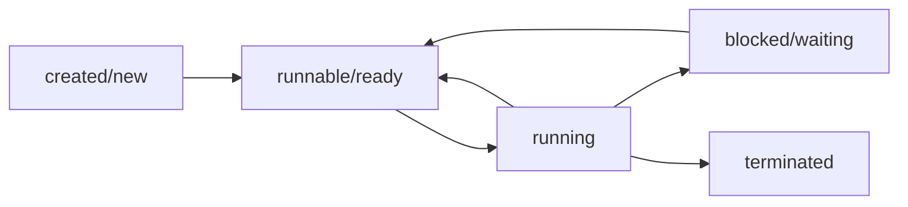
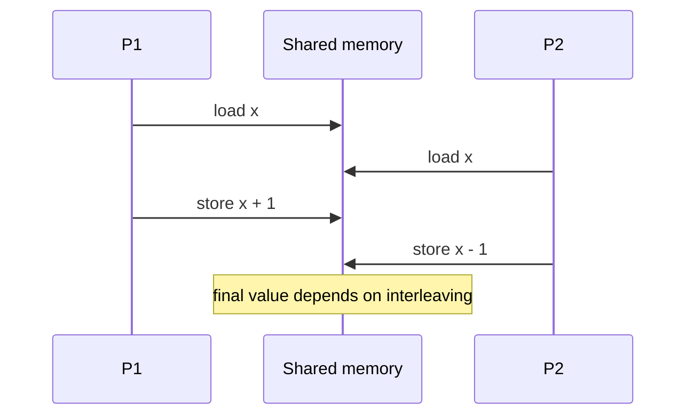
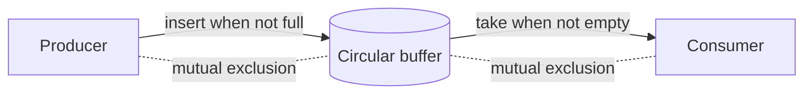
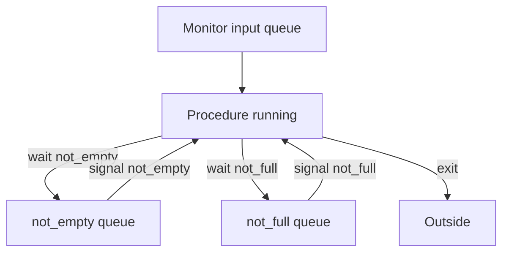
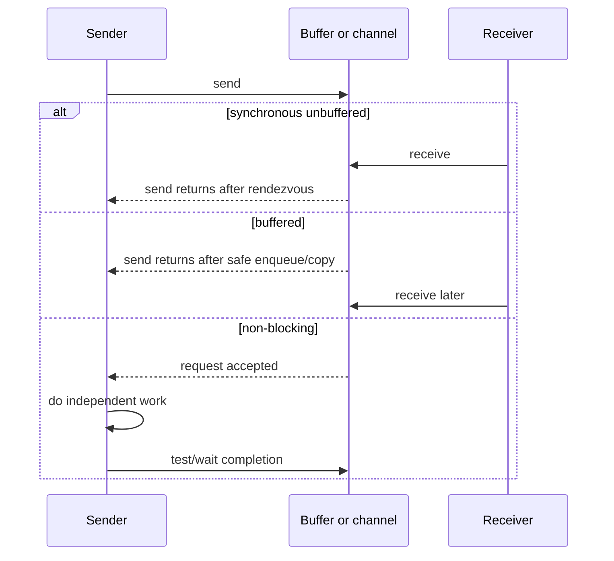
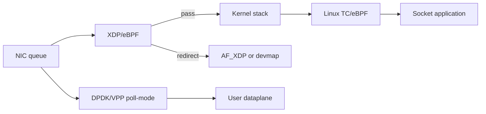
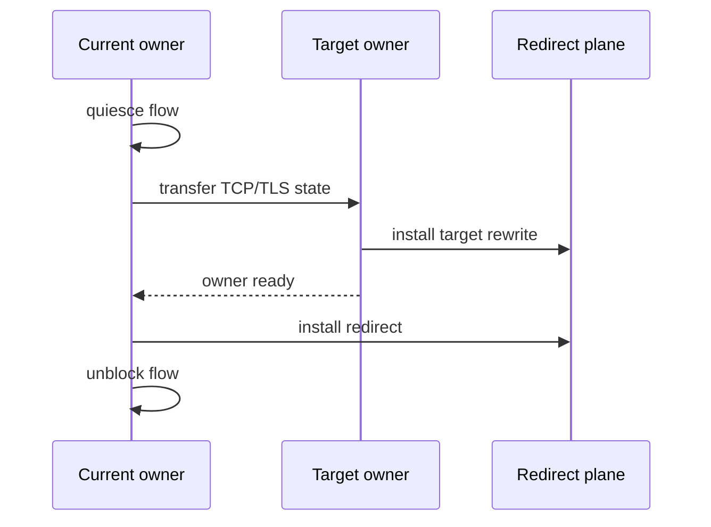
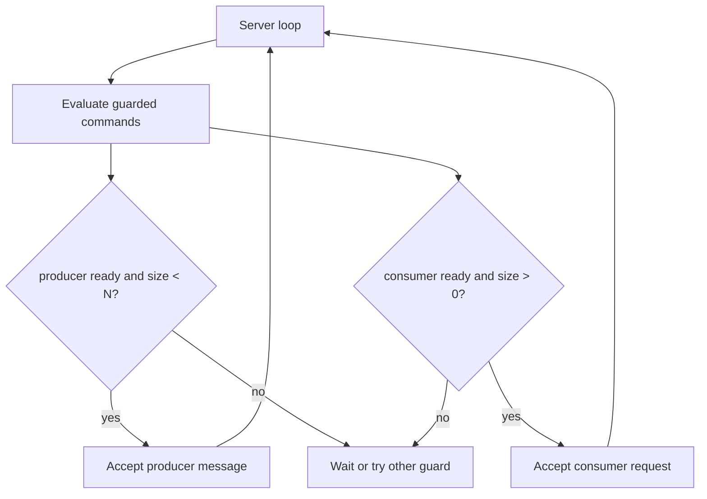
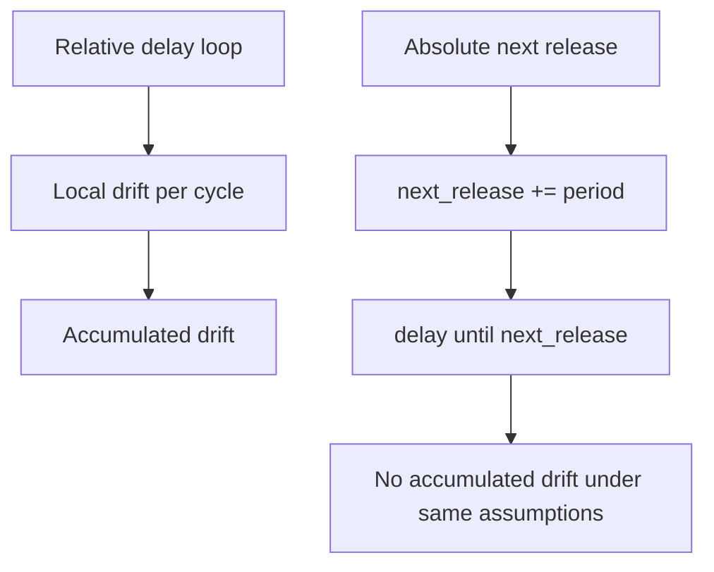
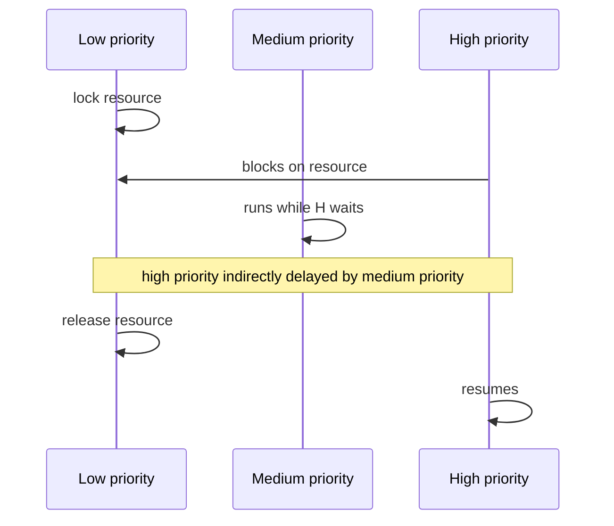

# Flow And Diagram Patterns

## Purpose
Use this file to turn a concurrency or real-time design into explicit process diagrams before coding or review. The diagrams are intentionally small so they can be copied into design notes, ADRs, code comments, or test plans.

## Process State Model



Use for:
- Threads and tasks.
- Java thread lifecycle reviews.
- Debugging hangs where a task is runnable versus blocked.

## Instruction Interleaving



Use for:
- Showing why a read-modify-write sequence is not atomic.
- Explaining transient race failures.

## Producer-Consumer Buffer



Review separation:
- Mutual exclusion protects buffer indices and slots.
- `not_full` prevents overwriting unconsumed data.
- `not_empty` prevents consuming nonexistent data.

## Monitor With Conditions



Use for:
- Bounded buffers.
- Alarm/timer monitors.
- Any monitor with more than one logical wait condition.

## Signal Semantics Comparison

```mermaid
flowchart TD
  Signal[c.signal()] --> HasWaiter{waiter exists?}
  HasWaiter -- no --> Continue[No condition waiter resumed]
  HasWaiter -- yes --> SC[SC: signaller continues]
  HasWaiter -- yes --> SX[SX: signaller exits]
  HasWaiter -- yes --> SW[SW: signaller waits in input queue]
  HasWaiter -- yes --> SU[SU: signaller waits in urgent queue]
  SC --> Risk[Waiter must recheck condition]
  SX --> Direct[Waiter resumes before input queue]
  SW --> Direct
  SU --> Urgent[Signaller later resumes before input queue]
```

Use for:
- Explaining why the same monitor code can work under one signal type and fail under another.

## Message-Passing Timeline



Use for:
- MPI send/receive ordering.
- Async offload queues.
- Buffer ownership reviews.

## Network Dataplane Pipeline



Use for:
- Choosing kernel socket, XDP, AF_XDP, Linux TC, DPDK, or VPP placement.
- Showing where packet ownership changes and where completion is observed.

## TCP Handoff Timeline



Use for:
- TCP connection offload, flow migration, and software-to-hardware redirect transitions.
- Checking stale-rule, partial-handoff, and packet-reorder failures.

## CSP Guarded Server



Use for:
- Avoiding server blocking on a passive client.
- Checking guard side effects.

## Periodic Drift



Use for:
- Rewriting `sleep(period)` loops.
- Real-time timer review.

## Priority Inversion



Mitigation diagrams:
- Priority inheritance: low priority temporarily runs at high priority while holding the resource.
- Priority ceiling: resource raises holder priority to the ceiling when locked.

## RMS/EDF Timeline Checklist
Use a Gantt-style table when Mermaid is too noisy.

```text
time: 0 1 2 3 4 5 6 7 8
cpu : A A B A C C idle ...
rel : A,B,C     A   B
ddl :     A B   A     C
miss: none
```

Record:
- Release.
- Start.
- Finish.
- Deadline.
- Blocking interval.
- Preemptions.
- Missed deadline count.
