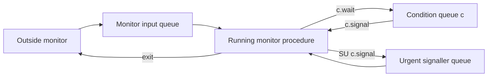
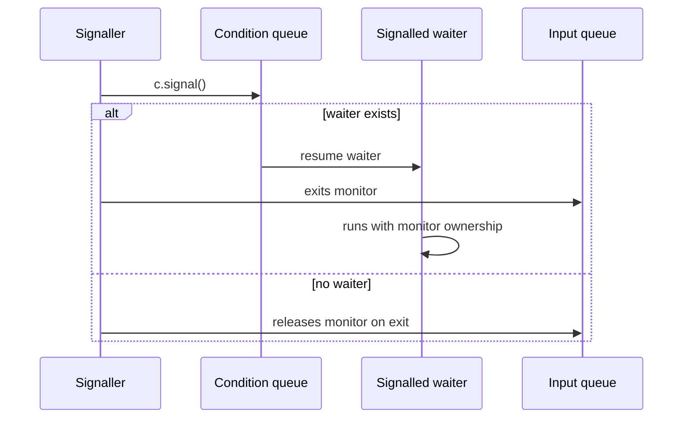
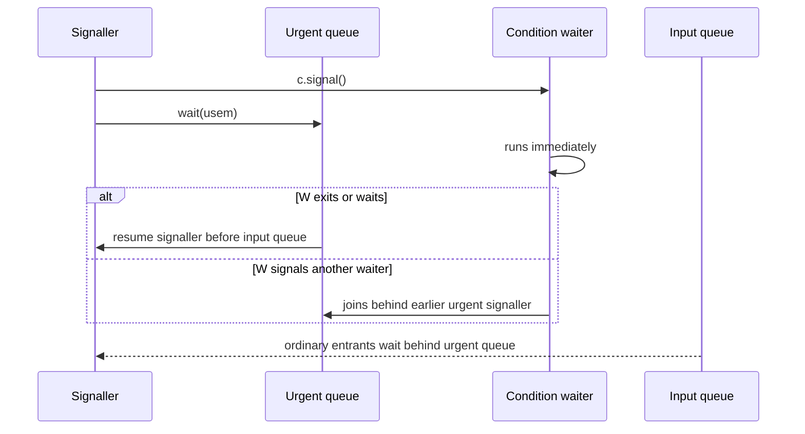
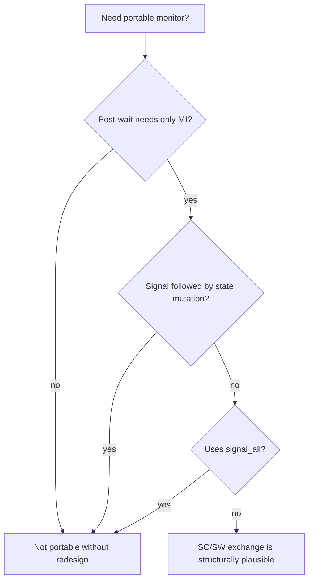

# Monitor Signalling Semantics

## Purpose
Use this reference when code or design depends on monitor condition variables, Java/POSIX conditions, `wait`/`notify`, signal stealing, or the exact behavior after `signal`.

## Monitor Queue Model
Classic monitors have several distinct queues:
- Monitor input queue: processes waiting to enter a monitor procedure.
- Condition queues: processes blocked by `c.wait()` until condition `c` is signalled.
- Urgent queue: used by urgent-signal semantics to let a signalling process regain monitor priority after the signalled process runs.

## Signal Types
| Signal | Name | Preemptive | Signaller after `c.signal()` | Main Coding Consequence |
| --- | --- | --- | --- | --- |
| AS | Automatic signal | Runtime-defined | Signal inserted implicitly | Programmer writes waits; runtime/compiler resumes waiters when conditions become true. |
| SC | Signal and continue | No | Continues in monitor | Signalled process must recheck condition because signal stealing is possible. |
| SX | Signal and exit | Yes | Must exit monitor after signal | `c.signal()` must be the last operation or followed by a wait/exit path. |
| SW | Signal and wait | Yes | Waits in monitor input queue | Signalled process runs before ordinary input-queue processes. |
| SU | Urgent signal | Yes | Waits in urgent queue | Signaller has priority to re-enter over ordinary monitor entrants. |

## Signal Stealing
Signal stealing occurs when a process from the monitor input queue enters before a previously signalled process resumes. That new process can change the monitor state and invalidate the condition that was true at signalling time.

Review rule:
- Under preemptive semantics, the signalled process resumes before third-party monitor entrants can steal the condition.
- Under SC semantics, always write waits as condition loops and ensure monitor invariant alone is sufficient after `wait`.

## SX Signal Flow
SX transfers monitor ownership to a waiting process and forces the signaller to leave the monitor.

Implementation model:
- Monitor lock semaphore `s` protects entry.
- One semaphore exists per condition queue.
- `count_cond` tracks waiters.
- `c.wait()` increments count, releases monitor lock, blocks on condition semaphore, then decrements count after resumption.
- `c.signal()` either resumes one condition waiter or releases the monitor lock when no waiter exists.

Coding discipline:
- Place `c.signal()` as the last instruction in the monitor procedure.
- Do not mutate permanent monitor variables after `c.signal()`.
- Do not use broadcast-style signalling as if all waiters could run immediately.

## SU Signal Flow
SU adds an urgent signaller queue. The signaller blocks after waking a condition waiter, but it has priority to re-enter after the resumed process releases or waits.

Implementation model:
- `urgent` counts suspended signallers.
- `usem` is the urgent queue semaphore.
- Exit and `c.wait()` transfer the monitor first to urgent signallers, then to ordinary input waiters.
- `c.signal()` increments `urgent`, resumes one condition waiter if present, blocks on `usem`, then decrements `urgent`.

Coding discipline:
- Use SU when the signalled process must observe the condition immediately and the signaller still has work to do after that process runs.
- Review urgent queue behavior for liveness: chains of signallers can change fairness even when safety is preserved.
- Do not assume ordinary input queue fairness while urgent signallers are pending.

## AS, SC, And SW Equivalence
The signal families can simulate one another, so they can express the same synchronization problems. The practical difference is how directly and clearly a solution can be written.

SC simulating AS:
- Replace each automatic await condition `B` with a condition queue `CB`.
- Use `while not B do CB.wait()` and signal where `B` becomes true.

AS simulating SC:
- Represent condition queues explicitly with per-process blocked flags.
- Signal by clearing the first blocked process flag.

SW simulating AS:
- Use the same loop shape as SC, but preemptive signal semantics resumes a waiter immediately.
- Insert enough signal operations where unblocking conditions become true, or liveness fails.

SW with AS simulation:
- Use a `pending_signal` flag so monitor entrants wait while a signal is pending.
- This prevents signal stealing.

## SC And SW Portability Discipline
A monitor can often be moved between SC and SW semantics without code changes only if these conditions hold:
- The monitor invariant is the only postcondition required after `c.wait()`.
- After `c.signal()`, the process exits the monitor or executes a `wait` path.
- `c.signal()` is not followed by assignments that change permanent monitor variables.
- `c.signal_all()` or broadcast is not used as if it had preemptive semantics.

## Nested Monitor Calls
If `mon1.proc1()` calls `mon2.proc2()` and `proc2()` waits, the runtime must decide what exclusion to release.

Option A: release only the innermost monitor.
- Simpler.
- Outer monitors remain inaccessible.
- Can reduce parallelism or deadlock if resumption requires the same outer monitor sequence.

Option B: release all monitors in the call stack.
- Requires tracking monitor ownership stack.
- Requires reacquiring previous monitors later.
- Requires restoring each monitor invariant before nested calls.
- Hard to implement correctly.

Practical rules:
- Avoid nested monitor calls in application code unless the language/runtime has explicit semantics for them.
- Prefer extracting shared protocol state into one monitor when nested waits are needed.
- If nested calls are unavoidable, state which monitor invariants hold before the nested call and which exclusions are released.
- Do not assume one universal rule across languages.

## Verification Rules
- Monitor initialization must establish the monitor invariant before procedures can be called.
- Before `c.wait()`, the monitor invariant must hold because the monitor becomes accessible to other processes.
- For preemptive signals, the unblocking condition can be part of the postcondition of `c.wait()` because no third process can steal the condition before the waiter resumes.
- For SC signals, `c.signal()` behaves like a null statement with respect to permanent monitor variables because the signaller keeps the monitor.
- Assertion-based safety proofs do not by themselves guarantee liveness. Missing signals or bad waits can still leave processes blocked forever.
- For reusable pseudocode patterns that exercise these rules, read `exercise-derived-patterns.md`.

## Review Checklist
- Which signal semantics is assumed: AS, SC, SX, SW, or SU?
- Does each condition variable have a named predicate?
- Does every wait release the monitor only after the monitor invariant is restored?
- Can signal stealing invalidate the condition?
- Is `signal` followed by permanent state mutation?
- Is `signal_all` used safely for the selected semantics?
- Are nested monitor calls forbidden, modeled, or explicitly supported by the runtime?
