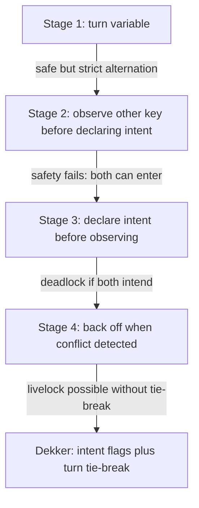
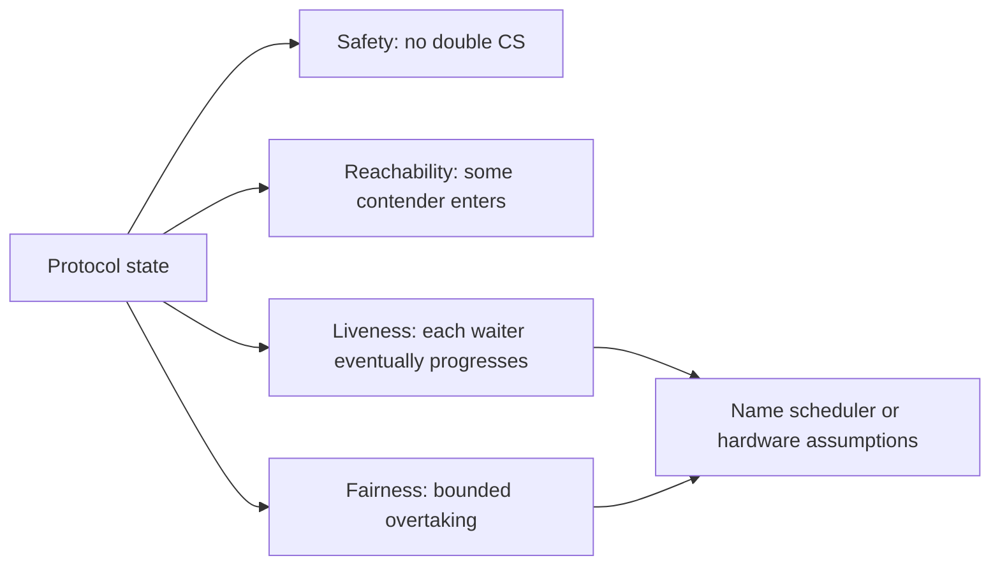

# Mutual Exclusion Algorithms

## Purpose
Use this reference when reviewing custom mutual exclusion protocols, teaching lock design, or diagnosing low-level race/deadlock/starvation behavior. Production code should still prefer proven runtime primitives unless the target level requires a custom algorithm.

## Dijkstra Conditions
An acceptable mutual exclusion algorithm must satisfy these conditions:
- Use only basic atomic read/write/check operations; do not assume special platform instructions unless declared.
- Do not assume relative process speed, except that each process has non-zero progress.
- A process outside its critical section must not prevent another process from entering.
- If processes try to enter, some process eventually reaches the critical section.

Important limit:
- These conditions rule out global deadlock and support reachability, but they do not by themselves prove starvation freedom or full fairness for every process.

## Refinement Flow To Dekker



Stage diagnostics:
- Strict alternation is safe but violates independence: a passive process can block an active one.
- Late intent marking fails safety: both processes can pass the check before either marks intent.
- Early intent marking preserves mutual exclusion but can deadlock when both mark intent.
- Symmetric backoff can livelock when both repeatedly yield.
- Dekker adds `turn` only for simultaneous contention.

## Dekker Pattern
Shared state:
- `c1`, `c2`: process intent flags.
- `turn`: tie-breaker when both processes want the critical section.

Entry idea:
- Mark own intent.
- While other intent is active, yield if turn belongs to the other process.
- Reassert own intent after turn changes.

Exit idea:
- Give turn to the other process.
- Clear own intent.

Properties:
- Mutual exclusion follows from one process entering only when the other key allows it.
- Reachability follows by contradiction over the possible `turn` and key states.
- Liveness and fairness can still depend on fairness of the memory access hardware. If hardware always prioritizes reads over writes, a process can be delayed.

Review questions:
- Are intent flags written before the critical-section check?
- Is there a conflict tie-break?
- Can both processes continually yield?
- Does the proof assume fair memory arbitration?

## Peterson Two-Process Pattern
Shared state:
- `c[i]`: whether process `i` is trying to enter.
- `turn`: process that resolves simultaneous entry conflict.

Entry shape:
```text
c[i] = true
turn = i
while c[j] == true and turn == i:
    wait
critical section
c[i] = false
```

Reasoning:
- Both processes cannot simultaneously satisfy their exit-from-wait condition because `turn` cannot be both values.
- If one process is passive, the other enters.
- If both wait, one `turn` value lets one process proceed.
- Fairness follows because a repeatedly entering peer must eventually set `turn` so the waiting process can enter.

## Peterson N-Process Pattern
The N-process version stages processes through `n - 1` filters before the critical section.

Shared state:
- `c[i]`: current stage of process `i`, with passive represented separately.
- `turn[j]`: process that last claimed stage `j`.

Mental model:
- Each stage eliminates at least one contender.
- A process can be overtaken, but the maximum wait is finite under the proof assumptions.

Verification lemmas:
- A process that precedes all others can advance at least one stage.
- A process advancing from stage `j` either precedes all others or is accompanied at stage `j`.
- If two or more processes are at stage `j`, then earlier stages are occupied.
- At most `n - j` processes can be in stage `j`; therefore at most one reaches the final critical-section stage.

## N-Process Exercise Patterns
The exercises introduce Dijkstra and Knuth-style N-process algorithms with states such as `passive`, `requesting`, and `inCS`.

Review use:
- Treat the state enum as a protocol state machine.
- Check whether `turn` can be changed by a passive owner.
- Check whether a process can be overtaken indefinitely.
- Check whether a modification changes safety, reachability, liveness, or fairness.
- For additional exercise-derived pseudocode patterns and counterexample workflow, read `exercise-derived-patterns.md`.

## Busy Waiting
Busy waiting consumes CPU or memory-bus cycles without useful progress. It can be acceptable only when:
- The system has few contenders.
- Wait duration is bounded and shorter than blocking overhead.
- The execution level makes blocking impossible or too costly.
- The proof does not rely on scheduler kindness.

Otherwise prefer blocking primitives such as mutexes, semaphores, condition variables, monitors, or message queues.

## Verification Template
1. Define `NOTSAFE`, usually "Pi in CS and Pj in CS".
2. Define protocol states outside, requesting, waiting, in critical section, and exiting.
3. Prove mutual exclusion by contradiction.
4. Prove reachability by considering solo entry and simultaneous contention.
5. Prove liveness or identify where scheduler/hardware fairness is assumed.
6. Prove fairness only if there is a bounded overtaking argument.


