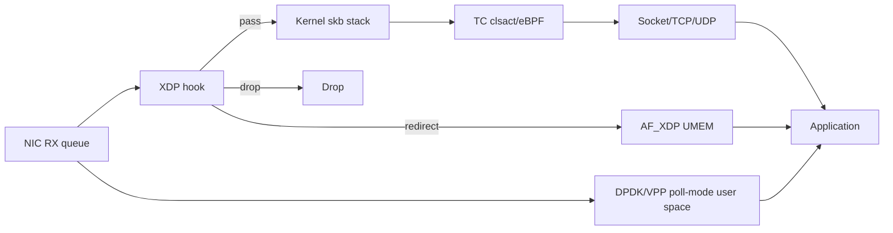
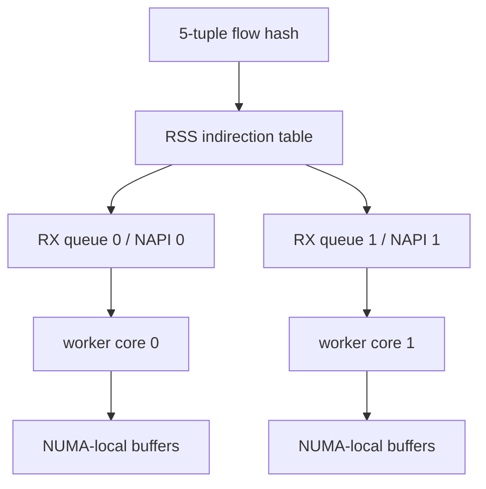
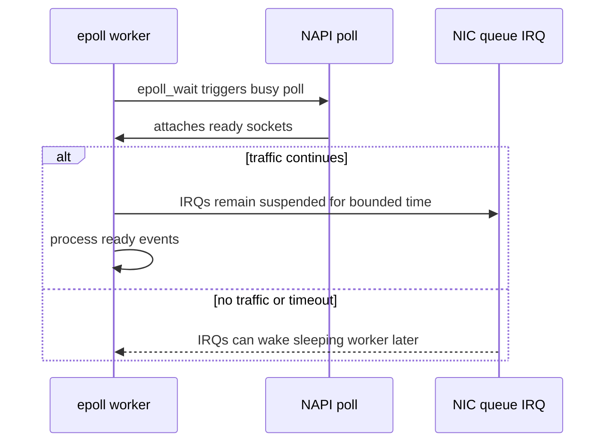
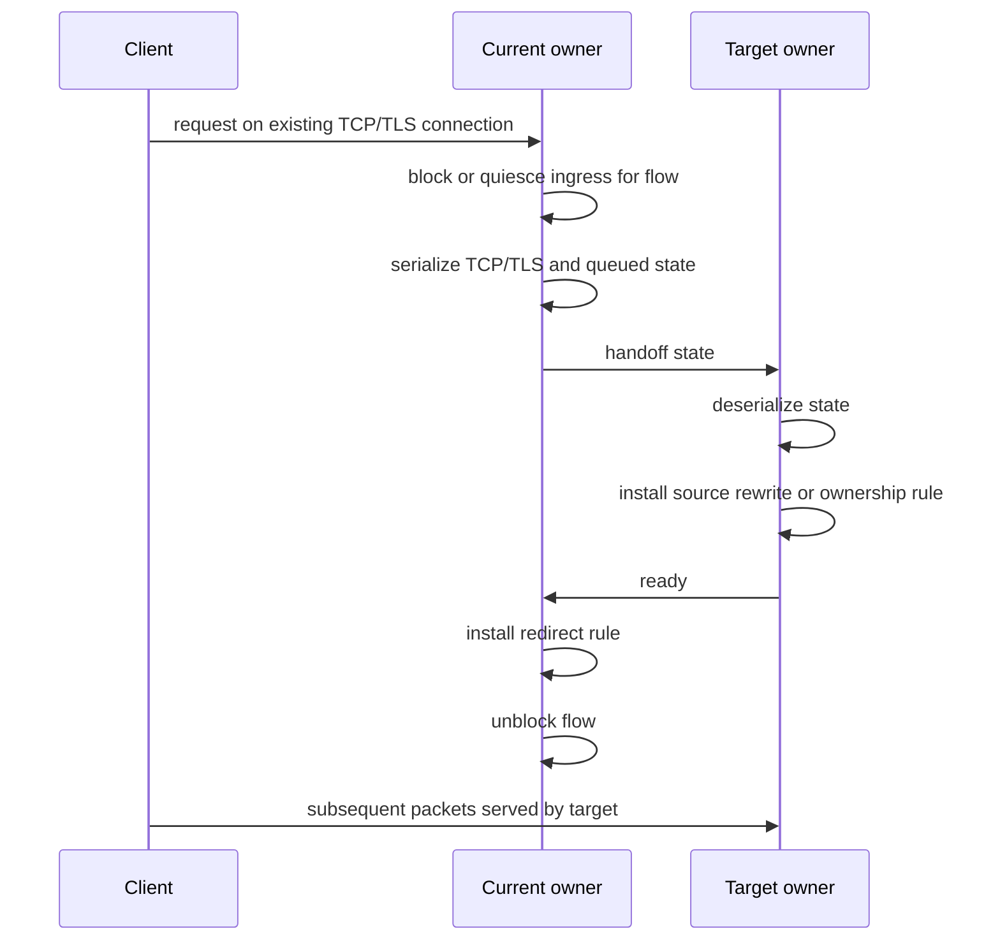
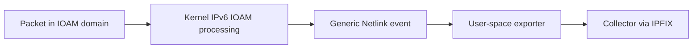

# Network Dataplane And Kernel Bypass

## Purpose
Use this reference for low-latency or high-throughput network systems that involve DPDK, VPP, eBPF, XDP, AF_XDP, Linux TC, RSS, NAPI, IRQ suspension, SR-IOV, SmartNIC/DPU, RoCEv2, RDMA, packet offload, TCP connection handoff, or kernel dataplane telemetry.

## Table Of Contents
- Decision map
- Datapath placement model
- Queue, CPU, and memory model
- DPDK and VPP
- eBPF, XDP, Linux TC, and AF_XDP
- RSS, NAPI, busy polling, and IRQ suspension
- SR-IOV, VF passthrough, and representors
- RoCEv2 and RDMA
- SmartNIC, DPU, and hardware rule offload
- TCP connection handoff and flow migration
- IOAM direct exporting and dataplane telemetry
- Verification checklist

## Decision Map
| Need | Prefer | Avoid When |
| --- | --- | --- |
| General correctness, maintainability, socket APIs | Kernel TCP/UDP sockets | The kernel path cannot meet p99 latency or packet rate. |
| Early packet drop, redirect, classification, or telemetry | XDP/eBPF or Linux TC eBPF | Protocol state exceeds verifier/map constraints or needs complex timers. |
| Dedicated high-rate packet processing | DPDK or VPP | Dedicated cores, hugepages, NUMA control, and operational ownership are unavailable. |
| Fast user-space packet I/O with kernel integration | AF_XDP | NIC/driver lacks zero-copy support or queue ownership is unclear. |
| VM/container direct NIC queue access | SR-IOV VF | Live migration, observability, or centralized policy is more important than latency. |
| Zero-copy remote memory or storage-style messaging | RoCEv2/RDMA | The fabric cannot provide congestion/loss discipline and memory registration lifecycle is unclear. |
| Near-NIC packet handling or Linux TC rule offload | SmartNIC, DPU, or hardware TC | The control plane cannot prove rule install/remove ordering and fallback behavior. |

## Datapath Placement Model
Model the packet path before choosing a tool.



Placement questions:
- Where is the first programmable decision: NIC hardware, XDP, Linux TC, socket, DPDK, VPP, or RDMA completion?
- Which component owns the packet buffer at each step?
- Which component is allowed to reorder, drop, redirect, coalesce, or batch packets?
- What is the completion signal before a buffer, flow, queue, or rule can be reused?
- What happens when a rule install, queue reset, VF reset, or device reset races with traffic?

## Queue, CPU, And Memory Model
Dataplane correctness depends on queue topology as much as API choice.

Model these facts:
- RX/TX queue count and mapping to CPU cores.
- RSS hash key, indirection table, and selected fields.
- NAPI ID or queue identity used by the application.
- IRQ affinity, busy-poll behavior, and whether the application thread shares the CPU with the NAPI poller.
- NUMA node of NIC PCIe device, hugepages, mempools, UMEM, and application threads.
- Cache-line ownership for rings, descriptors, queue pairs, and statistics.
- Backpressure source: ring full, CQ overflow, socket buffer, qdisc, map pressure, or PCIe/device queue.



Review rule: if RSS and worker affinity are not specified, any low-latency claim is incomplete.

## DPDK And VPP
DPDK and VPP move packet processing into user space and usually dedicate cores to polling.

DPDK design facts:
- Poll-mode drivers trade interrupt overhead for core consumption.
- `rte_mbuf`, mempools, rings, and hugepages become correctness objects.
- Lcore assignment, queue pinning, NUMA locality, and burst size determine latency and throughput.
- A ring enqueue/dequeue success is not end-to-end completion; define when packet ownership transfers.
- Hugepage and IOVA configuration are deployment dependencies, not incidental setup.

VPP design facts:
- VPP uses graph nodes that process vectors of packets.
- Feature arcs and graph placement decide when packet metadata is valid.
- Worker thread assignment and interface queue placement must match RSS/NIC queue policy.
- Plugin code must preserve buffer metadata contracts when adding nodes.

Use DPDK/VPP when:
- Packet processing is stable enough to own a dedicated dataplane runtime.
- Kernel socket semantics are unnecessary or can be isolated to a control plane.
- The team can operate hugepages, NIC binding, CPU isolation, and observability.

Avoid DPDK/VPP when:
- The workload is connection-heavy and depends on mature kernel TCP features.
- Latency budget cannot tolerate batching but packet rate does not justify polling.
- Deployment needs ordinary host networking, sidecars, or transparent service mesh behavior.

## eBPF, XDP, Linux TC, And AF_XDP
eBPF is a programmable constrained execution model. XDP and Linux TC are common packet hooks.

XDP:
- Runs early, before skb allocation for supported drivers.
- Best for drop, redirect, simple load balancing, sampling, and metadata setup.
- Use `XDP_PASS`, `XDP_DROP`, `XDP_REDIRECT`, or `XDP_TX` as explicit outcomes.
- Verify driver mode, generic mode, or offload mode; they have different performance and feature limits.

Linux TC eBPF:
- Runs later in the kernel path and can interact with skb metadata and qdisc/classifier context.
- Useful for redirection, policy, shaping integration, and hybrid hardware/software offload.

AF_XDP:
- Provides user-space packet I/O through UMEM and fill/completion rings.
- Zero-copy depends on NIC/driver support; copy mode has different cost.
- Completion ring ownership must be checked before reusing UMEM frames.

eBPF constraints:
- Verifier acceptance is part of the design.
- Maps are shared mutable state; define key lifetime, update atomicity, and eviction behavior.
- Tail calls, helper availability, map types, and program type limits differ by hook.
- Avoid long protocol state machines in eBPF unless each state transition is bounded and verifiable.

Hybrid pattern:

```text
fast_path:
    XDP/Linux TC classifies flow
    if rule exists:
        redirect or drop
    else:
        pass to kernel or user-space control plane

control_plane:
    validates policy
    installs map entry or Linux TC rule
    records rollback path and expiry
```

## RSS, NAPI, Busy Polling, And IRQ Suspension
RSS distributes flows to RX queues. NAPI schedules kernel packet polling. Busy polling lets user space spend CPU to reduce wakeup latency. IRQ suspension lets a network-dominant epoll application drive packet processing while suppressing device interrupts for a bounded interval when supported.

Use this flow when evaluating low-latency socket applications:



Design rules:
- Use RSS or ntuple steering to put target flows on known queues.
- Map one worker loop to one NAPI/queue where possible.
- Use `SO_INCOMING_NAPI_ID` or equivalent evidence to confirm flow-to-worker placement when available.
- Tune epoll busy-poll budget and timeout against max event processing time, not just average packet arrival.
- Per-NAPI settings are operational state; verify whether they survive queue resize, driver reload, or interface reset.
- Track CPU burn at low load and interference at high load. Full busy polling can hide idle cost.

Failure modes:
- IRQs interrupt the worker and destroy cache locality.
- Worker handles events from several queues and loses affinity benefit.
- RSS hash changes move a flow to another queue while per-flow state remains on the old worker.
- A queue resize recreates NAPI objects and drops per-NAPI tuning.

## SR-IOV, VF Passthrough, And Representors
SR-IOV exposes virtual functions from a physical NIC to guests or containers.

Concepts:
- PF: physical function managed by host/control plane.
- VF: virtual function assigned to a VM, container, or userspace dataplane.
- Representor: host-side port that represents a VF in switchdev-style control planes.

Use SR-IOV when:
- Latency and throughput require bypassing a virtual switch or tap path.
- Tenant/workload isolation can be mapped to VF-level queues and interrupts.
- The platform can manage VF lifecycle, MAC/VLAN/spoof-check, rate limits, and reset handling.

Risks:
- Live migration and transparent failover become harder.
- Observability moves away from the ordinary host network path.
- VF reset or PF reset can invalidate queues while the application still owns buffers.
- Security policy must be enforced by PF, switchdev, eBPF/Linux TC, or fabric controls rather than assumed.

Container note:
- Kubernetes SR-IOV device plugins and CNIs expose hardware resources to pods, but scheduler placement, NUMA hints, hugepages, and CPU pinning still need explicit validation.

## RoCEv2 And RDMA
RoCEv2 carries RDMA over UDP/IP. It gives low-latency and high-throughput semantics by moving transport and memory operations into the RNIC.

Core objects:
- Protection domain: memory and queue ownership boundary.
- Memory region: registered memory with local and remote keys.
- Queue pair: send/receive or RDMA operation endpoint.
- Completion queue: authoritative completion signal.
- Work request and work completion: operation lifecycle.

Design rules:
- Treat memory registration as a lifetime and security contract.
- Do not reuse or free registered buffers until the relevant completion is observed and deregistration is safe.
- Model CQ overflow and polling strategy; completion loss is a correctness failure.
- Include retry, timeout, QP error, and path migration behavior.
- RoCEv2 fabrics need congestion and loss discipline. PFC/ECN/DCQCN-style tuning is part of correctness for tail latency, not only network operations.
- Pin RDMA worker threads and memory near the RNIC NUMA node when latency matters.

Use RoCEv2/RDMA when:
- The application can express work as message, read, write, or atomic verbs.
- Zero-copy and completion semantics are worth the memory registration and fabric complexity.

Avoid it when:
- The protocol needs frequent dynamic memory, small unbatched control messages, or complex connection churn.
- The network cannot provide predictable loss/congestion behavior.

## SmartNIC, DPU, And Hardware Rule Offload
Hardware offload is useful only when the control plane can reason about asynchronous rule installation.

Patterns:
- Linux TC hardware offload for match/action rules.
- eBPF or Linux TC software rule as a temporary fast fallback while hardware rule install is pending.
- DPU/SmartNIC service chain for firewall, encryption, storage, or telemetry.
- RNIC offload for RDMA transport.

Rule lifecycle:

```text
install_rule(flow):
    add software fallback rule
    submit hardware rule install
    mark flow = hybrid_pending
    when hardware install completes:
        mark flow = hardware_active
        remove software fallback if safe

remove_rule(flow):
    block or quiesce flow if required
    remove hardware rule
    remove software fallback
    only then release flow state
```

Failure modes:
- Hardware rule install is slower than packet arrival.
- A non-cancellable netlink or device request completes after the flow was removed.
- Software and hardware paths disagree on rewrite metadata.
- Packets reorder while switching between software and hardware paths.
- Device reset removes rules but control-plane state still says active.

## TCP Connection Handoff And Flow Migration
Connection handoff is a distributed protocol, not just an optimization. The critical section is the interval where TCP/TLS state, packet redirection, and backend readiness must agree.



Correctness requirements:
- Freeze or account for in-flight ingress and egress packets during migration.
- Preserve TCP sequence state, send queue, receive queue, unsent data, and TLS state where applicable.
- Define owner-ready and redirect-ready as separate states.
- Use rollback for partial handoff: target not ready, redirect failed, serialization failed, or rule install timed out.
- Keep return path explicit: which owner removes redirect and when state moves back.
- Treat packet filtering rules and state transfer as a two-phase protocol with observable transitions.

## IOAM Direct Exporting And Dataplane Telemetry
IOAM direct exporting is for observability across a limited domain. It should not be confused with a fast-path packet processing framework.

Model:



Use it when:
- You need per-packet or sampled path telemetry inside a controlled domain.
- The telemetry path can tolerate added header processing and export overhead.
- The collector pipeline is part of the observability design.

Review:
- Header mode: inline or encapsulation.
- Optional fields: flow identifier and sequence number.
- Export mechanism: kernel event, user-space exporter, collector protocol.
- Backpressure behavior when exporter or collector cannot keep up.
- Measurement bias: instrumentation changes the datapath it measures.

## Verification Checklist
Before accepting a dataplane design, require:
- Datapath diagram with hook placement.
- Queue-to-core mapping, RSS policy, IRQ affinity, and NUMA placement.
- Buffer ownership states and completion signals.
- Rule lifecycle for eBPF maps, Linux TC filters, hardware rules, and rollback.
- Tail latency, packet loss, queue drops, CPU utilization, and jitter metrics.
- NIC counters: RX/TX drops, missed interrupts, queue errors, CQ overflow, pause/PFC stats where relevant.
- Reset and reconfiguration tests: queue resize, driver reload, VF reset, PF reset, link flap, map flush, and rule reinstall.
- Security boundary: PF/VF ownership, memory keys, map update authority, and tenant isolation.
- Operational fallback: what happens if offload, zero-copy, hardware rules, or RDMA setup fails.
