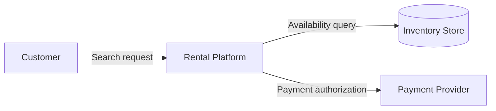
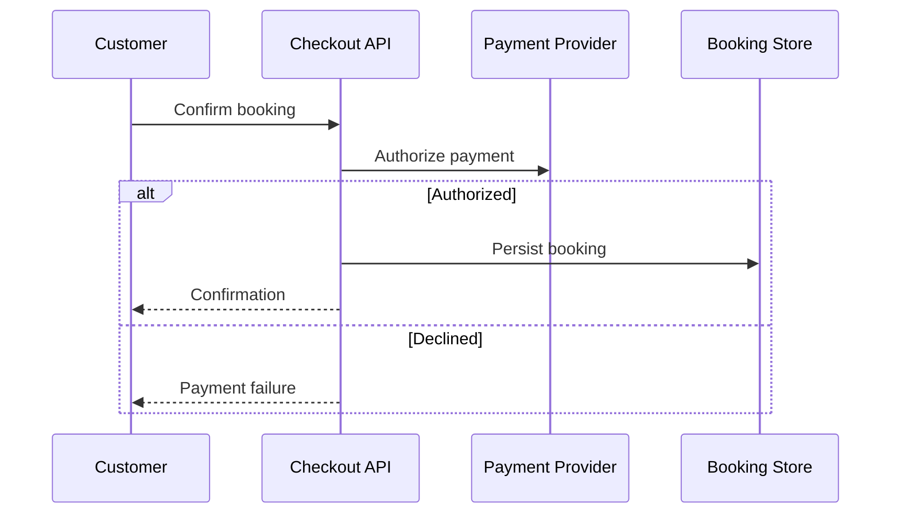

# Diagram And Visualization Guide

Use diagrams to expose architecture decisions. A diagram is useful when it clarifies ownership, boundary, interaction, data, deployment, quality tactic, or implementation order.

## Diagram Selection

| Need | Use |
|---|---|
| Define outside vs inside | Boundary/context diagram |
| Show users and goals | Use case diagram or actor/use-case table |
| Show structural decomposition | Component/package diagram |
| Show domain objects and relationships | Class/domain model or ER-style diagram |
| Show workflow | Activity diagram |
| Show component collaboration over time | Sequence diagram |
| Show object lifecycle | State machine |
| Show runtime placement | Deployment diagram |
| Show implementation structure | Development view map or package/component diagram |
| Show production operation | Operation view map, runbook flow, or operational dependency map |
| Show style integration | Schematic architecture diagram |
| Show NFR traceability | Conformance map |
| Show security enforcement | Reference Monitor / PEP-PDP policy flow |
| Show architecture-as-code alignment | Diagram/spec/repo/fitness-function alignment map |

## Visual Conventions

- Label every actor, component, store, node, message, and boundary.
- Use domain names rather than generic style names once the style is integrated.
- Show direction on data/control/event flows.
- Distinguish external systems from internal components.
- Distinguish deployable artifacts from runtime nodes.
- Mark async/event boundaries explicitly.
- Use notes sparingly for assumptions, constraints, and risk.
- Keep diagrams at one abstraction level unless the purpose is mapping between levels.

## Diagram Checks By Type

### Boundary/Context
- System boundary is visible.
- External actors and systems are outside the boundary.
- Each flow crossing the boundary is named.
- Trust and ownership boundaries are clear when relevant.

### Use Case/Functional Context
- Actors map to goals, not implementation classes.
- Use cases have clear triggers and outcomes.
- Include administrative, operational, and error/recovery use cases when architecturally relevant.

### Component/Package
- Components have cohesive responsibilities.
- Provided and required interfaces are visible or described nearby.
- Dependency direction is clear.
- Packages or modules can map to repository structure.

### Information/Class/Data
- Persistent objects are distinguished from session/temporary objects when needed.
- Relationships have cardinality and ownership.
- Data components/stores have owners and access rules.
- External source-of-truth relationships are explicit.

### Activity/Workflow
- Start/end points are clear.
- Branches, joins, loops, and parallel paths are intentional.
- Failure paths and compensations are shown when they affect architecture.

### Sequence
- Lifelines represent actors, components, external systems, or stores.
- Message order is meaningful.
- Async calls, callbacks, retries, alternatives, and optional fragments are explicit.
- State-changing calls show where state is persisted.

### State Machine
- States are stable lifecycle conditions.
- Transitions have triggers.
- Invalid transitions and terminal states are considered.
- Recovery states exist for long-running or failure-prone workflows.

### Deployment
- Nodes and execution environments are distinct.
- Software artifacts are allocated to runtime nodes.
- Network links, protocols, trust zones, and managed services are clear.
- Operational dependencies such as queues, schedulers, caches, and observability are included when relevant.

### Development
- Logical components map to repositories, packages, modules, namespaces, or generated-code areas.
- Dependency rules and allowed directions are visible.
- Shared libraries and framework adapters have explicit ownership.
- Fitness functions or CI checks are named when boundaries must be enforced.

### Operation
- Health checks, alerts, SLOs, backup/restore, migrations, rollback, and runbooks are visible when architecturally relevant.
- Operational actors and emergency/break-glass paths are included.
- Secret/key/certificate rotation and audit retention are shown when security or compliance depends on them.

### NFR Conformance
- Each NFR links to facts/policies, criteria, tactics, impacted views, and verification evidence.
- Tactics that change behavior, data, or deployment are visible.

### Security Enforcement
- Subject, protected resource, action, policy source, enforcement point, decision point, and audit log are visible.
- Deny, challenge, and failure paths are represented, not only permit paths.
- Trust boundaries and tenant/data classification boundaries are explicit.

### Architecture-As-Code
- Diagrams, constraint spec, repository structure, and executable checks are all represented.
- Logical names map to physical paths/packages/services.
- Failed check semantics are clear: code drift, stale diagram, stale spec, or intentional architecture change.

## Mermaid Guidance

Use Mermaid for quick text-native diagrams when the repo already accepts Markdown diagrams.

Boundary/context example:

Sequence example:

Keep generated diagrams small enough to review. If a diagram becomes unreadable, split it by view or scenario.

## Bundled Templates

Use these Mermaid templates as starting points:
- `templates/uap-flow.mmd`
- `templates/nfr-conformance-map.mmd`
- `templates/reference-monitor.mmd`
- `templates/architecture-as-code-alignment.mmd`
