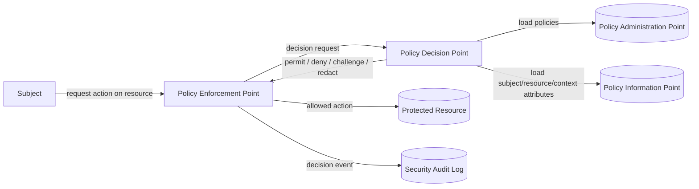
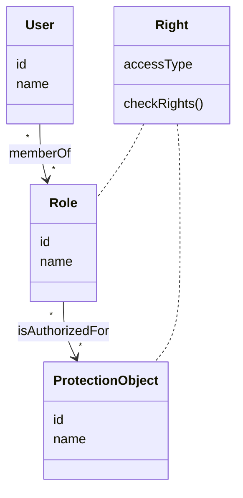
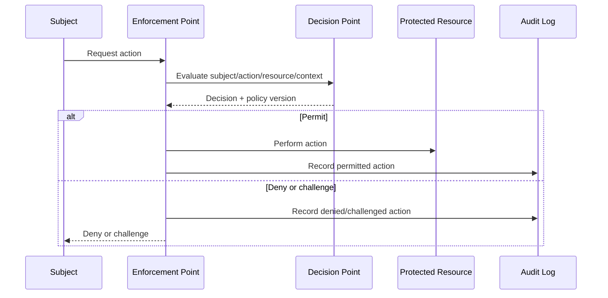

# Security Architecture Patterns

Use this catalog when security work goes beyond endpoint-level IAM. Select patterns by threat, trust boundary, policy ownership, enforcement point, audit need, and operational cost.

## Table Of Contents
- [Pattern Selection Flow](#pattern-selection-flow)
- [Identity And Authentication](#identity-and-authentication)
- [Authorization And Access Control](#authorization-and-access-control)
- [Reference Monitor And Policy Points](#reference-monitor-and-policy-points)
- [Audit And Security Logging](#audit-and-security-logging)
- [Network, Middleware, And Service Security](#network-middleware-and-service-security)
- [Misuse And Threat-Driven Design](#misuse-and-threat-driven-design)
- [Diagram Templates](#diagram-templates)

## Pattern Selection Flow

1. Identify protected resources: API operation, object, field, tenant, workflow, message, file, infrastructure action, or administrative capability.
2. Identify subjects: anonymous user, registered user, service account, workload, operator, admin, partner, device, or batch job.
3. Locate the enforcement point: gateway, application handler, domain service, repository, database policy, message consumer, middleware, OS/runtime, or network boundary.
4. Choose policy model: RBAC, ABAC/PBAC, ACL, capability, multilevel security, contextual/session policy, or hybrid.
5. Define decision semantics: permit, deny, challenge, step-up, redact, quarantine, log-only, or break-glass.
6. Define audit evidence and tamper resistance.
7. Verify with abuse cases and negative tests, not only happy-path authorization tests.

## Identity And Authentication

| Pattern | Use When | Architecture Notes |
|---|---|---|
| Identity Provider | A system needs centralized identity lifecycle, credential verification, federation, and claims issuance. | Keep application authorization separate from credential verification. |
| Identity Federation | Trust spans organizations, tenants, partner systems, or external IdPs. | Define trust anchors, claim mapping, issuer/audience, lifecycle, and deprovisioning. |
| Authenticator | Credentials or factors must be verified before issuing a session or token. | Isolate credential handling, rate limits, lockout/risk decisions, and recovery paths. |
| Remote Authenticator/Authorizer | Authentication/authorization is delegated to a remote service. | Model latency, availability, cacheability, fail-closed behavior, and policy drift. |
| Credential | Passwords, passkeys, API keys, tokens, certificates, recovery codes, or device keys exist as security objects. | Define storage, rotation, revocation, proof of possession, and compromise response. |

Use `references/iam-auth-architecture.md` for detailed auth endpoint design. Use this file to model the underlying security patterns and enforcement structure.

## Authorization And Access Control

| Pattern | Use When | Watch For |
|---|---|---|
| Authorization | Every protected action needs an explicit allow/deny decision. | Define subject, object, action, context, decision, and policy source. |
| RBAC | Rights map cleanly to job function, product role, tenant role, or operational responsibility. | Role explosion, contextual exceptions, stale assignments. |
| Session-Based RBAC | Active session context changes available roles or privileges. | Session fixation, stale role cache, privilege downgrade, logout/revocation. |
| PBAC/ABAC | Decisions depend on attributes, conditions, policy documents, environment, tenant, risk, time, or data sensitivity. | Policy sprawl, explainability, performance, policy testing. |
| XACML-Style Evaluation | Centralized policy authoring/evaluation is needed across multiple enforcement points. | Separate policy administration, decision, enforcement, and information points. |
| ACL | Resource-specific allow lists are small and local to the object. | Hard-to-audit sprawl, weak global policy, inheritance confusion. |
| Capability | Possession of an unforgeable token grants authority. | Leakage, delegation, expiry, attenuation, revocation. |
| Multilevel Security | Data classification and clearance dominate access decisions. | Rigid model, usability, cross-domain transfer, labeling correctness. |

Prefer RBAC for stable organizational permissions, PBAC/ABAC for contextual decisions, ACL for local object sharing, and capabilities for delegated possession-based authority. Hybrid models must document which model wins when they conflict.

## Reference Monitor And Policy Points

Reference Monitor is the reusable core: all access requests to protected resources must pass through an enforcement path that checks policy and returns an auditable decision.

Design rules:
- Enforcement must be complete: no alternate code path bypasses the PEP.
- Decisions must use stable inputs: subject, action, object, tenant, environment, risk, and policy version.
- Deny-by-default must be explicit for missing subject/object/policy/context.
- Cache decisions only with bounded TTL and invalidation tied to policy, role, tenant, and session changes.
- Policy failures must fail closed except documented emergency/break-glass operations.

## Audit And Security Logging

Use Security Logger/Auditor when the system must determine who did what, when, from where, under which authority, and with which result.

Audit events should include:
- subject id and assurance level;
- session id, token id/family, client/app id, device id when relevant;
- action, object/resource id, tenant, data classification;
- decision, policy id/version, role/attribute inputs, step-up result;
- request id/correlation id, IP/network metadata when relevant;
- before/after values for administrative and lifecycle changes;
- integrity metadata for tamper evidence.

Audit design forces:
- Accuracy: faithfully record sensitive actions.
- Security: protect audit records from unauthorized read/write/delete.
- Forensics: support investigation and attack reconstruction.
- Compliance: produce durable evidence.
- Performance: avoid synchronous bottlenecks on high-volume paths.

## Network, Middleware, And Service Security

| Pattern Area | Use When | Architecture Concerns |
|---|---|---|
| TLS / secure channel | Data crosses an untrusted or shared network. | Certificate lifecycle, mTLS, termination point, downgrade prevention. |
| VPN / private network | Network-level isolation is required between sites or workloads. | Routing, split tunneling, key rotation, blast radius. |
| Firewall / application firewall | Traffic must be filtered before reaching services. | Rule ownership, bypass paths, false positives, observability. |
| IDS / behavior detection | Attacks may be detected by signatures or anomalous behavior. | Signal quality, alert fatigue, response workflow. |
| Secure broker / ESB / middleware | Middleware mediates cross-service communication. | Message authentication, authorization, replay, schema validation, tenant separation. |
| Secure pipes and filters | Pipelines process sensitive or untrusted data. | Stage isolation, input validation, error routing, data minimization. |
| Secure MVC / three-tier | Application structure must embed auth, validation, and audit controls. | Avoid authorization only in UI/controller; enforce at server/domain/resource boundary. |

## Misuse And Threat-Driven Design

For each critical use case, add misuse cases:
- Actor attempts unauthorized access.
- Actor tampers with object id, tenant id, role, claim, or policy input.
- Actor replays old token/session/recovery code.
- Actor triggers excessive requests, lockout abuse, or MFA fatigue.
- Compromised admin attempts self-escalation or evidence deletion.
- Service bypasses gateway and calls internal resource directly.

Map each misuse case to one or more patterns, controls, tests, audit events, and operational response.

## Diagram Templates

RBAC core:

Security logging:

