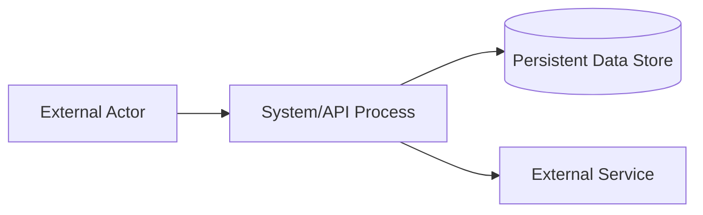

# Software Architecture & Engineering Skill

This skill turns software architecture work into a disciplined engineering process. Use it for greenfield architecture, architecture review, refactoring, modernization, platform design, API/service design, distributed-system design, codebase-to-architecture analysis, engineering planning, and implementation guidance.

The skill is a distilled operational synthesis, not a reproduction, of a software architecture methodology centered on a Unified Architecture Process (UAP). It must be applied with critical judgment, project evidence, and repository/document inspection. Do not invent requirements, constraints, technologies, or performance facts.

## 1. Operating Contract

### 1.1 Primary mission

When invoked, help the user move from ambiguous software intent to validated engineering artifacts:

- refined functional requirements and non-functional requirements (NFRs)
- stakeholder and concern map
- system context diagrams and boundary analysis
- schematic architecture and style rationale
- functional, information, behavior, and deployment views
- NFR tactics and conformance maps
- architecture evaluation plan and results
- ADRs/RFCs, implementation plan, tests, rollout plan, and code-review criteria

### 1.2 Do not hallucinate

Always distinguish among:

- **Known facts**: explicitly present in user input, codebase, documents, logs, diagrams, tests, or other available evidence.
- **Reasoned inferences**: logically derived from known facts but still uncertain.
- **Assumptions**: useful placeholders that must be confirmed.
- **Open questions**: missing information that changes architecture decisions.

Never present assumptions as established facts. When current external facts matter, say that live verification is needed unless reliable current sources are available.

### 1.3 Architecture before coding, but not architecture theater

Prefer the smallest architecture process that gives enough confidence for the decision at hand.

- For small, low-risk changes: use a lightweight path: context → affected components → risks → tests → patch plan.
- For high-risk systems: use the full UAP path: A1 → A2 → A3 → A4a/A4b/A4c/A4d → A5 → A6.
- Do not over-model. Every diagram or table must either clarify a decision, reveal a risk, enforce traceability, or guide implementation.

### 1.4 Evidence hierarchy

Use this order when analyzing a real system:

1. Running code, tests, build configuration, infrastructure configuration, schemas, API contracts, deployment manifests, and runtime logs.
2. Architecture docs, ADRs, RFCs, design docs, diagrams, SRS, product specs, incident reports.
3. User statements and domain constraints.
4. General engineering principles and patterns.
5. Assumptions, explicitly labeled.

## 2. Default Workflow: Unified Architecture Process

Use this as the canonical lifecycle. Tailor it to project size and risk.

### A0. Intake and Process Tailoring

Before A1, establish the project frame.

#### Inputs to request or infer

- product/system purpose
- domain and users
- existing codebase or greenfield status
- business objectives
- critical workflows
- known constraints: budget, team, timeline, compliance, latency, availability, data residency, cloud/on-prem, vendor restrictions
- technology stack and deployment environment
- risk tolerance and expected system lifetime

#### Tailoring decision

Decide whether to apply or omit each activity.

| Activity | Apply when | Can be reduced when |
|---|---|---|
| A1 Requirements Refinement | requirements are incomplete, conflicting, high-risk, or stakeholder-heavy | requirements are validated and scope is small |
| A2 System Context Analysis | external actors, systems, data flows, or boundaries matter | local/internal change with known context |
| A3 Schematic Architecture | major structural decision, new system, modernization, distributed design | small feature within stable architecture |
| A4 Views | architecture must be documented, implemented, reviewed, or coordinated | trivial/local implementation |
| A5 NFR Design | quality attributes drive success or failure | no meaningful NFR impact |
| A6 Evaluation | design has risk, cost, scale, compliance, novelty, or irreversibility | reversible low-risk change |

#### Output

Produce a short architecture work plan:

```markdown
## Architecture Work Plan
- Scope:
- Tailored process:
- Artifacts to produce:
- Known facts:
- Assumptions:
- Open questions:
- Highest-risk decision:
```

## 3. A1 — Requirements Refinement

Goal: turn ambiguous stakeholder/system requirements into an architecture-ready requirements baseline.

### Step 1. Identify Stakeholders

Identify stakeholder groups and create stakeholder profiles.

#### Stakeholder groups to consider

- end users and user roles
- operators/SRE/DevOps/platform teams
- business owners and product managers
- developers and maintainers
- security, compliance, legal, audit
- data owners and data consumers
- third-party systems and integration owners
- support/customer success
- finance/procurement
- regulators or certification bodies

#### Stakeholder profile template

```markdown
| Stakeholder | Goals | Concerns | Decisions influenced | Evidence/source | Priority |
|---|---|---|---|---|---|
```

### Step 2. Refine Functional Requirements

Find and resolve deficiencies in functional requirements.

#### Deficiency checklist

Flag any requirement that is:

- ambiguous
- incomplete
- inconsistent with another requirement
- duplicated
- unverifiable
- mixed with implementation detail without rationale
- missing actor, trigger, input, output, precondition, postcondition, or exception path
- too broad to design/test
- not traceable to stakeholder value

#### Functional requirement refinement table

```markdown
| ID | Original requirement | Deficiency | Refined requirement | Rationale | Acceptance criteria | Source |
|---|---|---|---|---|---|---|
```

### Step 3. Refine Non-Functional Requirements

Acquire architectural concerns and convert them into measurable NFRs.

#### NFR categories

- performance: latency, throughput, jitter, resource efficiency
- scalability: user growth, data growth, regional growth, tenant growth
- availability: uptime, failover, redundancy, graceful degradation
- reliability/resilience: error handling, recovery, retries, data durability
- security: authentication, authorization, confidentiality, integrity, threat resistance
- privacy: data minimization, retention, consent, residency
- modifiability: extensibility, maintainability, plugin ability, migration ease
- interoperability: protocol compatibility, API stability, data exchange
- usability/accessibility: user success, accessibility, learnability
- observability: logs, metrics, tracing, auditability, debugging
- deployability: CI/CD, rollback, environment parity
- safety: hazard prevention, fail-safe behavior, human override
- cost: infrastructure cost, operational cost, engineering cost
- compliance: standards, regulations, certification constraints

#### NFR refinement pattern

```markdown
| NFR ID | Quality attribute | Scenario/stimulus | Environment | Response | Measure | Priority | Source |
|---|---|---|---|---|---|---|---|
```

Good NFRs are measurable. Bad NFRs say “fast,” “secure,” or “scalable” without a workload, threat, target, or test.

## 4. A2 — System Context Analysis

Goal: understand the system boundary, actors, persistent information, and high-level behavior before choosing architecture.

### Step 1. Boundary Context

Represent the system as a context-level Data Flow Diagram (DFD) or equivalent.

#### Model elements

- **Processes**: system tiers, major subsystems, external processors.
- **Terminals**: users, devices, external services, organizations, third-party systems.
- **Data stores**: persistent data, queues, object storage, caches, ledgers, model stores.
- **Data flows**: commands, queries, events, files, streams, API calls, telemetry, notifications.

#### Boundary context output

```markdown
## Boundary Context
- System boundary:
- External terminals:
- Internal processes/tier candidates:
- Data stores:
- Information flows:
- Trust boundaries:
- Protocol candidates:
- Data sensitivity by flow:
```

Include a DFD-like Mermaid diagram when useful:



### Step 2. Functional Context

Define actors, use cases, and relationships.

#### Actor classification

- primary active actor: initiates a goal
- secondary active actor: supports execution
- passive actor: receives or stores information
- software agent actor: autonomous or automated participant
- external system actor: third-party or upstream/downstream system

#### Use-case relationship checklist

Use relationships only when they clarify behavior:

- include: mandatory reusable subflow
- extend: optional/conditional behavior
- generalization: specialized actors/use cases
- association: actor participates in use case

#### Functional context output

```markdown
| Actor | Type | Goal | Use cases | Notes |
|---|---|---|---|---|

| Use case | Trigger | Inputs | Outputs | Preconditions | Postconditions | Exceptions |
|---|---|---|---|---|---|---|
```

### Step 3. Information Context

Identify persistent object classes and relationships.

#### Class identification heuristics

Look for:

- domain nouns that persist beyond one request
- transactions, records, events, sessions, profiles, accounts, inventory, permissions
- physical entities and logical entities
- aggregates and ownership boundaries
- audit records and derived analytics

#### Relationship types

- association
- aggregation
- composition
- inheritance/generalization
- dependency
- many-to-many relation via association class

#### Information context output

```markdown
| Class/entity | Responsibility | Key attributes | Relationships | Cardinality | Persistence need | Sensitivity |
|---|---|---|---|---|---|---|
```

### Step 4. Behavior Context

Allocate functional groups onto tiers and describe context-level control flow.

#### Invocation patterns to identify

- sequential invocation
- explicit/direct invocation
- closed-loop feedback invocation
- parallel invocation
- event-based invocation
- timed/scheduled invocation

#### Behavior context output

```markdown
| Flow | Trigger | Participants | Invocation pattern | Sync/async | Failure behavior | NFR relevance |
|---|---|---|---|---|---|---|
```

## 5. A3 — Schematic Architecture Design

Goal: create a high-level architecture by selecting, evaluating, integrating, and refining architecture styles.

### Step 1. Identify Candidate Architecture Styles

First determine inherent system types.

#### System-type to style mapping

| System type | Typical indicators | Candidate styles |
|---|---|---|
| Data-flow system | transformation pipeline, staged processing, ETL, media/data processing | Batch Sequential, Pipe-and-Filter |
| Data-sharing system | multiple components coordinate through common data | Shared Repository, Active Repository, Blackboard |
| Layered system | abstraction levels, policy/domain/infrastructure separation | Layered, MVC/PAC variants |
| Tiered system | physical distribution across client/server/application/data nodes | N-Tier, Client-Server |
| Load-balancing system | replicated workers, work distribution, failover | Broker, Dispatcher, Master-Slave, Peer-to-Peer, Edge |
| Event-based system | event production/consumption drives control flow | Event-Driven, Publisher-Subscriber, SCA for control systems |
| Service-based system | external or internal services expose capabilities over network | SOA, Microservices, REST, Serverless |
| Adaptive system | plugins, runtime adaptation, extension points | Microkernel, Plug-In, Reflective |
| High-scale stateful system | distributed state, session/data partitioning, elastic scale | Space-Based, Event-Driven, Microservices |
| Simple cohesive product | limited scope, single deployable, small team | Monolithic, Modular Monolith, Layered |

### Step 2. Evaluate Candidate Styles

For every candidate style, evaluate applicability, benefits, drawbacks, and fit.

```markdown
| Style | Why considered | Fit to functional needs | Fit to NFRs | Benefits | Drawbacks | Risks | Decision |
|---|---|---|---|---|---|---|---|
```

Do not choose microservices, event-driven architecture, serverless, or distributed data by fashion. Choose them only when the system’s forces justify their complexity.

### Step 3. Integrate Architecture Styles

Most real systems combine styles. Integrate explicitly.

Recommended integration order:

1. Tiers and physical distribution
2. Services and external integrations
3. Layers and internal responsibility separation
4. Behavior and invocation patterns
5. Adaptability and variability mechanisms
6. Remaining supporting styles

For each integration, define structural elements and connectors. Name elements with domain meaning, not generic labels.

```markdown
| Style integrated | Scope | Structural elements | Connectors | Data ownership | Failure mode | Engineering implication |
|---|---|---|---|---|---|---|
```

### Step 4. Refine Schematic Architecture

Refine structural elements and connectors until the architecture is implementable.

#### Refinement checklist

- Are all major functional groups represented?
- Are component responsibilities cohesive?
- Are connectors named and typed: API call, event, queue, stream, file, shared DB, RPC, pub/sub, batch job?
- Are data ownership and persistence boundaries clear?
- Are trust boundaries visible?
- Are external systems separated from internal components?
- Are failure paths and retry/idempotency concerns visible?
- Are deployment constraints represented?
- Does the schematic architecture trace back to requirements and NFRs?

## 6. A4 — Design Architecture Views

The core architecture views are Functional, Information, Behavior, and Deployment. Use other views selectively: Context, Development, Operation.

### A4a. Functional View

Goal: define functional components, interfaces, allocation, and variability.

#### Step 1. Refine Use Case Model

- refine functional groups
- refine actors
- refine use cases
- refine relationships
- write use case descriptions

#### Step 2. Define Functional Components

Derive components from:

- related use cases
- functional groups
- architecture styles
- interface components/adapters
- cross-cutting concerns when justified

#### Step 3. Allocate Functional Components

Assign components to tiers and placeholders.

```markdown
| Component | Responsibility | Use cases served | Tier/layer | Depends on | Exposes | Owner/team |
|---|---|---|---|---|---|---|
```

#### Step 4. Define Functional Component Interfaces

For each component:

- provided interfaces: operations the component exposes
- required interfaces: dependencies it needs
- input/output contracts
- preconditions/postconditions
- error model
- authentication/authorization expectations
- idempotency and retry semantics

```markdown
| Interface | Provider | Consumer | Operation/event | Inputs | Outputs | Errors | NFR notes |
|---|---|---|---|---|---|---|---|
```

#### Step 5. Design Functional Variability

Define variation points and variants.

```markdown
| Variation point | Variants | Selection rule | Runtime/build-time | Pattern/tactic | Tests required |
|---|---|---|---|---|---|
```

Common realization mechanisms:

- Strategy pattern
- Plugin architecture
- Feature flags
- Configuration-driven behavior
- Dependency injection
- Policy engine
- Rule engine
- Provider interface + adapters

### A4b. Information View

Goal: define persistent object model, data components, interfaces, persistence, and data resilience.

#### Step 1. Refine Persistent Object Model

- refine persistent classes/entities
- refine relationships
- define cardinalities
- define attributes and identifiers
- introduce session classes when session state has lifecycle importance
- introduce association classes when many-to-many relationships carry attributes
- separate physical object classes from logical object classes

#### Step 2. Define Data Components

Derive data components from class clusters, relationship strength, architecture styles, and data ownership.

```markdown
| Data component | Owns entities | Read models | Write authority | Consistency model | Retention | Sensitivity |
|---|---|---|---|---|---|---|
```

#### Step 3. Allocate Data Components

Allocate data components to tiers, data placeholders, services, or storage systems.

```markdown
| Data component | Storage location | Access path | Replication | Backup | Migration concern |
|---|---|---|---|---|---|
```

#### Step 4. Define Data Component Interfaces

Define CRUD/query/event interfaces carefully.

- commands mutate state
- queries read state
- events describe facts that happened
- schemas must be versioned
- data access must enforce ownership and security boundaries

#### Step 5. Design Object Persistence

Choose persistence medium and resilience tactics.

Persistence choices:

- relational database
- document database
- key-value store
- column store
- graph database
- event store
- object storage
- file system
- in-memory store/cache
- search index
- model/vector store

Data resilience tactics:

- backups and restore tests
- replication
- snapshots
- transaction boundaries
- idempotent writes
- outbox/inbox pattern
- event sourcing when audit/replay justify it
- schema migration plan
- data validation and constraints
- encryption at rest and in transit
- retention and deletion workflows

### A4c. Behavior View

Goal: define runtime behavior, interactions, control flow, concurrency, timing, and state transitions.

#### Step 1. Refine System Control Flow

Refine invocation patterns:

- sequential
- explicit/direct
- closed-loop
- parallel
- event-based
- timed

#### Step 2. Identify Key Behavioral Elements

Target detailed behavior diagrams for:

- high-risk use cases
- critical components
- persistent object lifecycle
- distributed transactions
- concurrency-sensitive flows
- security-sensitive flows
- latency-sensitive paths
- failure recovery flows

#### Step 3. Define Detailed Control Flows

Choose representation schemes:

- activity diagram for workflow/control logic
- sequence diagram for interaction order
- state machine diagram for object lifecycle/state transitions
- timing diagram for real-time constraints
- dataflow/stream diagram for pipelines

```markdown
| Scenario | Diagram type | Reason | Success path | Failure path | NFR checked |
|---|---|---|---|---|---|
```

### A4d. Deployment View

Goal: define physical/logical deployment topology, execution environments, network connectivity, and artifact allocation.

#### Step 1. Define Computing Device Nodes

Examples:

- user devices
- edge devices
- IoT devices
- servers
- containers hosts
- Kubernetes nodes
- managed platform nodes
- databases
- network appliances
- ML accelerators/GPU nodes

#### Step 2. Define Execution Environments

Examples:

- browser
- mobile runtime
- JVM/Node/Python/.NET runtime
- container
- Kubernetes namespace
- serverless function runtime
- database engine
- message broker
- model serving runtime

#### Step 3. Define Network Connectivity

Specify:

- communication paths
- protocols
- ports
- network zones
- trust boundaries
- ingress/egress
- service discovery
- TLS/mTLS
- rate limits
- firewalls/security groups
- private/public connectivity

#### Step 4. Allocate Software Artifacts

Artifacts include:

- services
- packages
- libraries
- containers/images
- functions
- schemas/migrations
- static assets
- model artifacts
- jobs/workers
- infrastructure modules

```markdown
| Artifact | Versioning | Built from | Deployed to | Runtime | Config/secrets | Health checks |
|---|---|---|---|---|---|---|
```

## 7. A5 — Design for Non-Functional Requirements

Goal: convert quality requirements into architecture tactics and prove conformance.

### Step 1. Identify Facts and Policies

Facts are objective constraints. Policies are rules/intentions imposed by business, organization, regulation, or architecture governance.

```markdown
| ID | Type | Fact/policy | Source | Implication |
|---|---|---|---|---|
```

### Step 2. Define Criteria for Tactics

Each criterion must be grounded in one or more facts/policies.

```markdown
| Criterion ID | Criterion | Grounded in fact/policy | Quality attribute | Measure |
|---|---|---|---|---|
```

### Step 3. Define Candidate Architecture Tactics

Tactics are concrete design moves used to satisfy NFRs.

#### Tactic catalogue by quality attribute

| Attribute | Candidate tactics |
|---|---|
| Performance | caching, batching, async processing, connection pooling, read replicas, CDN, indexing, data locality, backpressure, profiling, avoiding chatty calls |
| Scalability | horizontal scaling, stateless services, partitioning/sharding, queue-based load leveling, autoscaling, tenant isolation, distributed caching |
| Availability | redundancy, failover, health checks, load balancing, graceful degradation, circuit breaker, retry with backoff, bulkheads, multi-zone deployment |
| Reliability/resilience | idempotency, timeout budgets, sagas, transactional outbox, recovery workflows, dead-letter queues, validation, checkpointing, replay |
| Security | least privilege, strong authn/authz, input validation, secrets management, encryption, audit logs, threat modeling, dependency scanning, sandboxing |
| Privacy | data minimization, pseudonymization, retention controls, consent flow, access logging, residency controls, deletion workflows |
| Modifiability | modular boundaries, stable interfaces, adapter pattern, plugin points, dependency inversion, feature flags, configuration, test seams |
| Interoperability | standard protocols, versioned APIs, OpenAPI/AsyncAPI, schema registry, compatibility tests, canonical data model, adapters |
| Observability | structured logs, metrics, distributed tracing, correlation IDs, audit trails, SLOs, alerts, dashboards, runbooks |
| Deployability | CI/CD, blue-green/canary, rollback, IaC, immutable images, migration automation, config validation, environment parity |
| Usability | accessibility, responsive UI, feedback loops, error explanation, progressive disclosure, localization |
| Safety | fail-safe defaults, human override, hazard analysis, redundancy, bounded actuation, state validation, simulation tests |
| Cost efficiency | autoscaling, right-sizing, storage lifecycle, cache policy, reserved capacity, cost guardrails, workload scheduling |
| Data quality | constraints, validation, deduplication, lineage, reconciliation, schema governance, data contracts |

### Step 4. Evaluate Candidate Tactics

```markdown
| Tactic | Benefit | Cost | Complexity | Risk | Trade-offs | Chosen? | Rationale |
|---|---|---|---|---|---|---|---|
```

### Step 5. Integrate Selected Tactics

Apply tactics to the affected architecture views.

```markdown
| Tactic | Functional view impact | Information view impact | Behavior view impact | Deployment view impact | Engineering tasks |
|---|---|---|---|---|---|
```

### Step 6. Validate Conformance

Build a conformance map that traces each NFR to tactics, artifacts, and tests.

```markdown
| NFR | Criteria | Tactics | Architecture elements | Verification method | Test/metric | Status |
|---|---|---|---|---|---|---|
```

No NFR is satisfied until it has a measurable verification path.

## 8. A6 — Architecture Evaluation

Goal: transform an assumed architecture into a validated architecture by identifying risks, issues, drawbacks, and improvement actions.

### Step 1. Identify Target Elements for Evaluation

Evaluate elements with high impact or uncertainty:

- architecture style selection
- schematic architecture
- component boundaries
- interface contracts
- data ownership
- consistency model
- deployment topology
- NFR tactics
- security/trust boundaries
- scalability bottlenecks
- compliance-sensitive elements
- novel technologies
- expensive or irreversible decisions

### Step 2. Select Evaluation Approach and Methods

| Approach | Use when | Methods |
|---|---|---|
| Scenario-based | stakeholder concerns, quality attributes, trade-offs | ATAM, CBAM, SAAM, SBAR, PATS |
| Model-based | analyzable structure/behavior/performance/reliability | ADL, UML, queueing model/network, statecharts, network simulation, feature model |
| Formal method-based | safety/mission-critical correctness, strict invariants | Z, OCL, ASM, Petri Net, temporal logic, algebraic specification, model checking |
| PoC-based | high-risk technical feasibility, unknown integration, novel technology | focused executable proof of concept |
| Prototype-based | usability, workflow validation, stakeholder feedback, system behavior exploration | functional or throwaway prototype |

### Step 3. Apply Evaluation and Incorporate Results

```markdown
| Target | Method | Scenario/model/property | Result | Risk | Required change | Owner | Deadline |
|---|---|---|---|---|---|---|---|
```

Evaluation is incomplete unless findings change the architecture, confirm a decision, or explicitly document accepted risk.

## 9. Part III Resource: Architecture Style Catalogue

Use this catalogue as a decision aid. Always evaluate fit, benefits, limitations, and engineering implications.

### 9.1 Data-flow styles

| Style | Use when | Strengths | Watch-outs | Engineering implications |
|---|---|---|---|---|
| Batch Sequential | offline or scheduled staged processing | simple, traceable, modular stages | high latency, rigid ordering | jobs, checkpoints, retryable stages, batch monitoring |
| Pipe-and-Filter | streaming or staged transformations where filters can be composed | composability, reuse, parallelizable filters | data format friction, pipeline debugging | define filter contracts, backpressure, stream metrics, dead-letter handling |

### 9.2 Data-sharing and problem-solving styles

| Style | Use when | Strengths | Watch-outs | Engineering implications |
|---|---|---|---|---|
| Shared Repository | multiple components coordinate through common shared data | centralized consistency, simple integration | coupling through data, bottleneck, schema conflicts | database ownership rules, migrations, access layer, audit |
| Active Repository | shared data changes must notify interested components | responsiveness, synchronization | notification overhead, subscription complexity | change data capture, event dispatch, subscription registry |
| Blackboard | multiple specialized knowledge sources solve complex/uncertain problem | flexible incremental problem solving | non-determinism, debugging difficulty | rule/agent orchestration, shared state model, trace logs |

### 9.3 Layering and user-interface styles

| Style | Use when | Strengths | Watch-outs | Engineering implications |
|---|---|---|---|---|
| Layered | clear abstraction levels are needed | separation, maintainability, testability | shortcut paths can erode discipline | enforce dependency direction, package boundaries, layer tests |
| MVC | interactive app separates presentation, control, and model | separation of concerns, parallel work, UI flexibility | overhead for small apps, view synchronization | controllers/routes, model services, UI state patterns |
| MVP | UI testability and presenter logic matter | testable presentation logic | presenter bloat | presenter interfaces, view mocks |
| MVVM | data binding/reactive UI fits platform | cleaner UI state, binding | binding complexity | view models, state stores, reactive tests |
| MVPVM | complex UI needs presenter and view-model roles | flexible separation | high complexity | strict role definitions |
| HMVC | large UI/app modules need nested MVC structures | modular UI composition | coordination overhead | module boundaries, nested routers/controllers |
| MVA | adapter mediates view/model differences | flexible integration | adapter sprawl | adapter contracts, mapping tests |
| PAC | hierarchical interactive agents are useful | separates presentation, abstraction, control | conceptual overhead | agent/component hierarchy, message routing |

### 9.4 Distribution and coordination styles

| Style | Use when | Strengths | Watch-outs | Engineering implications |
|---|---|---|---|---|
| N-Tier | logical responsibilities are physically distributed | scalability, deployment separation | network latency, operational complexity | API boundaries, deployment topology, environment configs |
| Client-Server | clients request centralized services | simple distributed model | server bottleneck, availability dependency | API server, auth, load balancer, client compatibility |
| Peer-to-Peer | equal nodes share resources directly | decentralization, resource sharing | consistency, security, discovery complexity | peer discovery, consensus/sync, NAT/security strategy |
| Broker | clients/services need mediated communication | decoupling, location transparency | broker bottleneck/failure | service registry, broker HA, contract governance |
| Dispatcher | work must be routed to handlers/workers | flexible routing/load distribution | dispatcher centrality | routing rules, worker pools, backpressure |
| Master-Slave | central coordinator delegates work | simple coordination, parallelism | master bottleneck/failure | leader election, worker health, task queues |
| Edge Computing | low latency/local data processing near devices | latency, bandwidth efficiency, privacy | distributed management, security surface | edge deployment, sync, offline mode, remote observability |

### 9.5 Event, messaging, and control styles

| Style | Use when | Strengths | Watch-outs | Engineering implications |
|---|---|---|---|---|
| Event-Driven | components react to state changes/actions | decoupling, scalability, responsiveness | event ordering, replay, eventual consistency | event contracts, schema registry, outbox, DLQ, tracing |
| Publisher-Subscriber | producers and consumers communicate by topics | loose coupling, many-to-many distribution | topic governance, delivery semantics | broker, topic naming, consumer groups, idempotency |
| Sensor-Controller-Actuator | system senses environment and acts in feedback loop | real-time control, adaptive response | timing, safety, coordination | control loop, state machine, simulation, failsafe |

### 9.6 Service and cloud-native styles

| Style | Use when | Strengths | Watch-outs | Engineering implications |
|---|---|---|---|---|
| SOA | enterprise services integrate heterogeneous systems | interoperability, reuse, governance | middleware overhead, standards complexity | service registry, contracts, orchestration, monitoring |
| Microservices | independently deployable bounded services are justified | team autonomy, scaling, independent release | distributed complexity, data consistency, ops burden | service ownership, API/event contracts, observability, CI/CD |
| Serverless | event-driven managed execution with variable load | low ops, elastic scale | cold starts, vendor coupling, limits | function boundaries, managed triggers, cost monitoring |
| REST | resource-oriented stateless APIs fit integration | simplicity, cacheability, interoperability | over/under-fetching, weak workflows | resources, HTTP semantics, OpenAPI, versioning |
| Space-Based | high-scale stateful systems need distributed in-memory space | elastic scaling, avoids DB bottleneck | complexity, consistency trade-offs | partitions, data grid, replication, conflict handling |

### 9.7 Adaptability and structural styles

| Style | Use when | Strengths | Watch-outs | Engineering implications |
|---|---|---|---|---|
| Microkernel | stable core with extensible plugins | extensibility, isolation of optional features | plugin compatibility, performance overhead | plugin API, lifecycle, compatibility tests |
| Plug-In | optional/extensible capabilities are needed | modular extension | dependency/version conflict | extension points, manifest, sandboxing |
| Reflective | system must observe/adapt its own structure/behavior | runtime adaptability | difficult reasoning/testing | metadata model, policy engine, runtime safeguards |
| Monolithic | product is cohesive, team is small, distribution is unnecessary | simplicity, easy local development | scaling/team coupling as system grows | modular monolith, clean packages, internal boundaries |

## 10. Part III Resource: Evaluation Method Catalogue

### Scenario-based methods

- **ATAM**: analyze architectural trade-offs against quality attribute scenarios; useful for stakeholder-heavy risk discovery.
- **CBAM**: extend trade-off analysis with cost-benefit reasoning; useful when budget and value prioritization matter.
- **SAAM**: assess modifiability and scenario fit; useful for maintainability and evolution concerns.
- **SBAR**: use scenarios to guide architecture reengineering; useful for modernization/refactoring.
- **PATS**: scenario-driven performance analysis; useful when response time/throughput risks dominate.

### Model-based methods

- **ADL**: architecture description language for formalized structure.
- **UML**: component, class, activity, sequence, state, and deployment models.
- **Queueing model/network**: throughput, utilization, response time, bottleneck prediction.
- **Statecharts**: state-dependent behavior and transitions.
- **Network simulation model**: topology, latency, bandwidth, failure behavior.
- **Feature model**: variability/commonality analysis for product lines/configurable systems.

### Formal methods

- **Z**: mathematical specification of state and operations.
- **OCL**: constraints over UML models.
- **ASM**: abstract machine-based operational semantics.
- **Petri Net**: concurrency, synchronization, reachability, deadlock analysis.
- **Temporal Logic**: time-qualified properties and model checking.
- **Algebraic Specification**: formal data-type behavior.

### Implementation-driven evaluation

- **PoC**: validate high-risk design decisions through minimal implementation.
- **Prototype**: validate workflows, usability, stakeholder expectations, or architectural behavior through an executable approximation.

## 11. Engineering Translation Layer

Architecture must become engineering work. Convert design outputs into implementation artifacts.

### 11.1 ADR template

```markdown
# ADR: <Decision title>

## Status
Proposed | Accepted | Deprecated | Superseded

## Context
Known facts, constraints, stakeholders, NFRs, and forces.

## Decision
The chosen architecture/engineering decision.

## Options considered
| Option | Pros | Cons | Risks |
|---|---|---|---|

## Consequences
Positive, negative, operational, cost, security, and migration consequences.

## Verification
How this decision will be validated: tests, metrics, review, PoC, model, benchmark.

## Traceability
Related requirements, NFRs, components, diagrams, tickets, commits.
```

### 11.2 RFC/design document template

```markdown
# RFC: <Title>

## Problem
## Goals
## Non-goals
## Stakeholders
## Requirements
## NFRs
## Current state
## Proposed architecture
## Architecture views
### Functional view
### Information view
### Behavior view
### Deployment view
## Alternatives
## Risks and mitigations
## Security and privacy
## Observability
## Rollout/migration plan
## Testing strategy
## Open questions
## Decision log
```

### 11.3 Repository mapping

Map architecture to code.

```markdown
| Architecture element | Code location | Owner | Tests | Runtime artifact | Notes |
|---|---|---|---|---|---|
```

When coding:

- preserve component boundaries
- avoid cross-layer imports
- keep public interfaces stable or version them
- encode invariants in types, schemas, tests, and runtime guards
- create migration scripts for schema/data changes
- update documentation and ADRs with code changes

### 11.4 Implementation breakdown

```markdown
| Work item | Architecture source | Code area | Dependencies | Test required | Risk | Rollback |
|---|---|---|---|---|---|---|
```

### 11.5 Engineering quality gates

A design is implementation-ready only when:

- functional requirements are traceable to components/interfaces
- NFRs are traceable to tactics and tests/metrics
- data ownership is clear
- high-risk behavior has sequence/activity/state representation
- deployment topology is defined enough for environment setup
- security boundaries are visible
- operational ownership is defined
- ADRs exist for major decisions
- evaluation risks are resolved, mitigated, or accepted

A code change is architecture-compliant only when:

- it respects component boundaries
- it includes or updates tests
- it preserves API/schema compatibility or includes migration/versioning
- it does not introduce hidden coupling
- it updates relevant docs/ADRs
- it is observable in production when operationally meaningful

## 12. Diagram and Visualization Protocol

Use diagrams when they reduce ambiguity. Prefer Mermaid or PlantUML unless the user specifies otherwise.

### Required diagram types by activity

| Activity | Diagram/table |
|---|---|
| A1 | stakeholder map, requirement refinement table, NFR scenario table |
| A2 | context DFD, use case diagram/table, class/entity diagram, behavior/activity diagram |
| A3 | schematic architecture diagram, style evaluation matrix |
| A4a | component diagram, interface table, variability map |
| A4b | class/entity diagram, data ownership map, persistence topology |
| A4c | sequence/activity/state diagrams |
| A4d | deployment diagram, network/trust-boundary diagram, artifact allocation table |
| A5 | facts/policies → criteria map, criteria → tactics map, NFR conformance map |
| A6 | evaluation target matrix, scenario/model/formal/PoC result table |
| Engineering | repo map, dependency graph, rollout plan, test matrix |

### Consistency checks across diagrams

- Every use case maps to at least one functional component.
- Every persistent class/entity maps to a data component and persistence decision.
- Every component interface appears in behavior flows where relevant.
- Every deployed artifact maps to a component or data component.
- Every NFR maps to tactics, architecture elements, and verification method.
- Every external integration has a protocol, auth model, failure behavior, and owner.

## 13. Architecture Review Checklist

Use this for audits.

### Requirements and context

- Are stakeholders and concerns explicit?
- Are functional requirements testable?
- Are NFRs measurable?
- Are external systems and trust boundaries visible?
- Are data flows and sensitivity classified?

### Structure

- Are architecture styles selected for explicit reasons?
- Are component boundaries cohesive and loosely coupled?
- Is data ownership unambiguous?
- Are dependencies directional and controlled?
- Are connectors and protocols explicit?

### Behavior

- Are critical flows modeled?
- Are failure paths defined?
- Are retries, timeouts, idempotency, and consistency handled?
- Are concurrent or async flows observable and debuggable?

### Deployment and operation

- Is topology realistic?
- Are runtime environments specified?
- Are health checks, metrics, logs, traces, and alerts defined?
- Is rollback possible?
- Are secrets/configuration handled safely?

### NFR and evaluation

- Are quality attributes satisfied by concrete tactics?
- Are trade-offs documented?
- Are risks evaluated with suitable methods?
- Are PoCs/prototypes used for high uncertainty?
- Are accepted risks explicit?

## 14. Response Patterns

### 14.1 When designing architecture

Respond in this order:

1. Restate scope and highest-risk unknown.
2. List assumptions and open questions.
3. Tailor the UAP activities.
4. Produce architecture artifacts progressively.
5. Explain trade-offs, not just recommendations.
6. End with verification and next engineering steps.

### 14.2 When reviewing an existing architecture

Respond in this order:

1. Evidence inspected.
2. Main weakness or risk first.
3. Strengths.
4. Gaps by UAP activity/view.
5. Concrete remediation plan.
6. Tests/evaluation needed.

### 14.3 When asked to generate code

Do not jump directly to code if architecture-critical details are missing. First identify affected architecture elements, boundary constraints, API/schema changes, tests, and rollback/migration needs. Then generate the smallest safe patch.

### 14.4 When asked for modern engineering choices

For frameworks, libraries, cloud services, pricing, versions, laws, compliance, or current best practices, use live verification when available. Otherwise mark the recommendation as requiring verification.

## 15. Minimal Outputs by Task Type

| Task type | Minimum useful output |
|---|---|
| Greenfield architecture | requirements baseline, context, schematic architecture, views, NFR tactics, evaluation plan, implementation roadmap |
| Feature design | affected requirements, component/interface changes, behavior flow, data changes, tests, rollout |
| Refactor | current coupling, target boundaries, migration steps, safety tests, ADR |
| Architecture audit | risk-ranked findings, traceability gaps, NFR gaps, remediation roadmap |
| API design | resources/operations/events, schemas, auth, error model, versioning, compatibility tests |
| Data design | entities, ownership, schema, consistency, migration, retention, privacy/security |
| Platform/infra | deployment view, network/security, CI/CD, observability, reliability tactics, cost risks |
| ML/AI system | data pipeline, model lifecycle, serving architecture, evaluation, drift monitoring, safety/privacy |

## 16. Definition of Done

An architecture answer is complete when it contains:

- scope and assumptions
- selected process depth
- architecture decisions with rationale
- at least one structural representation when structure matters
- NFR tactics and validation path when quality matters
- engineering translation: code/repo/deployment/test implications
- risks and trade-offs
- next steps that are concrete and ordered

